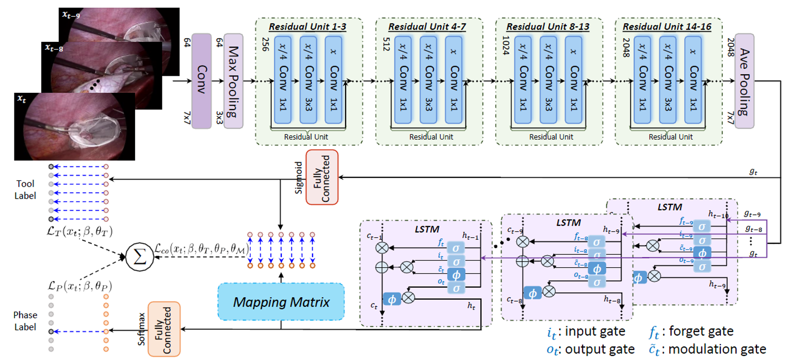

# MTRCNet-CL
Pytorch implementation of our multi-task recurrent convolutional network for joint surgical phase recognition and tool presence detection.

**Paper:**
[Multi-task recurrent convolutional network with correlation loss for surgical video analysis](https://www.sciencedirect.com/science/article/pii/S1361841519301124)
<br/>
Medical Image Analysis 2020

<p align="center">
  
</p>

**Participated Challenge:**
<br/>
We recently employed our method to participate the [MICCAI'2019 Surgical Workflow and Skill Analysis Challenge](https://www.synapse.org/#!Synapse:syn18824884/wiki/), and achieved compelling results:
[Winner](https://www.synapse.org/#!Synapse:syn18824884/wiki/599131) of Phase Recognition Task & 
[Runner-up](https://www.synapse.org/#!Synapse:syn18824884/wiki/599131) of Tool Presence Detection Task

* The implementation in current folder is based on Pytorch 0.4.0; we also have the version of Pytorch 1.0+

## Data Preparation
* We use the dataset [Cholec80](http://camma.u-strasbg.fr/datasets).

* Training and test data split: first 40 videos for training and the rest 40 videos for testing, following the original paper [EndoNet](https://arxiv.org/abs/1602.03012).

* Data Preprocessing: 
1. Using [FFmpeg](https://www.ffmpeg.org/download.html) to convert the videos to frames; 
2. Downsample 25fps to 1fps (Or can directly set the convert frequency number as 1 fps in the previous step); 
3. Resize original frame to the resolution of 250 * 250.

## Setup & Training

1. Check dependencies:
   ```
   - pytorch 0.4 / 1.0+
   - opencv-python
   - numpy
   - sklearn
   ```
2. Clone this repo
    ```shell
    git clone https://github.com/YuemingJin/MTRCNet-CL
    ```

3. Training multi-task recurrent convolutional network

* Run ``$ get_paths_labels.py`` to generate the files of dataset split and path, which is needed for the model training.

* Run ``$ train_mtrcnet.py`` to start the training, note that we initialize the weights of backbone shared layers with a pre-trained model on ImageNet.

* ``$ train_mtrcnet_cl.py`` is to learn the mapping matrix. Note that we first squeeze the parameter of two branches and only train mapping matrix. And then we release all the parameters and jointly train the whole network.

  ```
  Note: We also provide the Single Net version that only for phase recognition (``$ train_singlenet_phase.py``) OR tool presence detection task ``$ train_singlenet_tool.py``.
  ```

## Testing

We provide test files for different variants of models:
* test_mtrcnet.py : multi-task network with two branches 
* test_mtrcnet_cl.py : multi-task network with two branches and correlation map
* test_singlenet_phase.py : single-task network for phase recognition
* test_singlenet_tool.py:  single-task network for tool presence detection


### Citation
If you find the code useful for your research, please cite our paper.
```
@article{jin2020multi,
  title={Multi-task recurrent convolutional network with correlation loss for surgical video analysis},
  author={Jin, Yueming and Li, Huaxia and Dou, Qi and Chen, Hao and Qin, Jing and Fu, Chi-Wing and Heng, Pheng-Ann},
  journal={Medical image analysis},
  volume={59},
  pages={101572},
  year={2020},
  publisher={Elsevier}
}
```

### Note
* Contact: Yueming Jin (ymjin5341@gmail.com)
